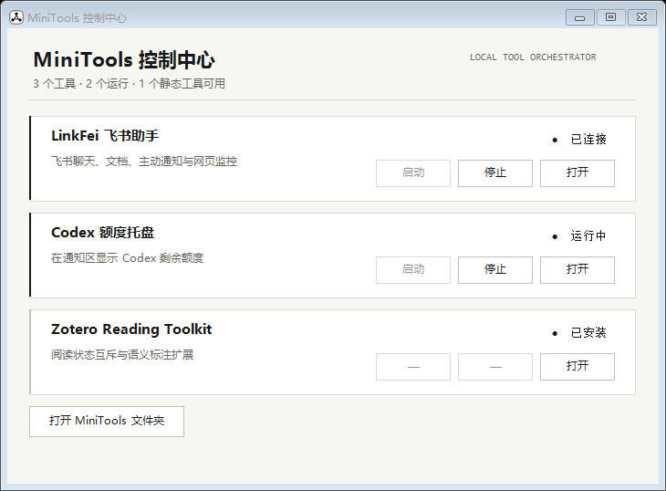

# MiniTools

一组面向 Windows 的轻量本地工具，以及用于统一管理它们的 MiniTools 控制中心。项目尽量复用 Windows 自带能力：控制中心和托盘程序使用 PowerShell、WinForms 与 VBScript，LinkFei 使用 Node.js，Zotero Reading Toolkit 使用原生扩展接口。



## 包含的工具

| 工具 | 功能 | 运行环境 |
| --- | --- | --- |
| [MiniTools 控制中心](minitools-controller/README.md) | 统一显示状态、启动、停止、打开并自动恢复本地工具；自动跟随 Windows 深浅色主题 | Windows PowerShell 5.1 |
| [Codex Quota Tray](codex-quota-tray/README.md) | 在通知区域用双环展示 Codex 短周期和长周期剩余额度 | Windows 10/11、已登录的 Codex |
| [LinkFei](linkfei/README.md) | 飞书长连接机器人、DeepSeek 问答、文档、记忆、通知、网页监控及本机 Codex 远程控制 | Node.js 22.5+、飞书应用、DeepSeek API |
| [Zotero Reading Toolkit](zotero-reading-toolkit/README.md) | Zotero 阅读状态互斥、语义标注类型与按语义汇总的阅读笔记 | Zotero 8–10 |

各工具可以独立使用；控制中心通过 [`tools.json`](minitools-controller/tools.json) 将它们组合在一起。

## 近期能力

- **飞书控制 Codex**：LinkFei 在本机通过 Codex App Server 创建、查看、继续和停止受限工作目录中的任务。只接受已绑定的飞书私聊，命令审批为单次、限时授权；电脑无需暴露公网端口。
- **可靠的控制中心**：服务启动和就绪检查异步执行；异常退出按退避策略恢复，连续失败后暂停等待人工处理。界面会随 Windows 的“应用模式”在浅色与深色主题间自动同步。
- **Zotero 阅读笔记**：可按当前语义标注名称把所选文献或 PDF 的标注汇总为原生 Zotero 笔记，保留文字、评论、页码和返回标注的链接。

## 快速开始

克隆仓库：

```powershell
git clone https://github.com/qianlinnian/MiniTools.git
cd MiniTools
```

如果只需要 Codex 额度托盘，确保 Codex 已登录，然后双击：

```text
codex-quota-tray\Run Codex Quota Tray.vbs
```

如果需要使用 LinkFei，先安装依赖并创建本地配置：

```powershell
cd .\linkfei
npm install
Copy-Item .env.example .env
```

在 `.env` 中填入自己的 DeepSeek API Key、飞书 App ID 和 App Secret。随后返回仓库根目录，安装统一控制中心：

```powershell
cd ..\minitools-controller
powershell.exe -ExecutionPolicy Bypass -File .\Install.ps1
```

安装器会创建开始菜单、桌面和当前用户开机启动入口。也可以直接双击 `Run MiniTools Controller.vbs` 临时运行。

如需从飞书控制本机 Codex，在 LinkFei 已启动、并已在自己的飞书私聊执行 `/notify bind` 后运行：

```powershell
cd .\linkfei
node scripts/setup-codex-remote.mjs
```

该命令只在本机 `data/codex-remote.json` 写入授权私聊与允许的项目目录；完整命令说明见 [LinkFei README](linkfei/README.md#飞书控制-codex)。

## 目录结构

```text
MiniTools/
├─ minitools-controller/   # 统一控制中心
├─ codex-quota-tray/       # Codex 双额度托盘
├─ linkfei/                # 飞书机器人与本地服务
├─ zotero-reading-toolkit/ # Zotero 扩展
└─ docs/                   # README 图片
```

## 安全与隐私

仓库不包含任何可用的 API Key、访问令牌、飞书凭据、Codex 登录数据、聊天数据库或运行日志。

- LinkFei 的真实配置只应保存在 `linkfei/.env`；仓库只提供空值模板 `.env.example`。
- `node_modules/`、`data/`、`logs/`、SQLite 数据库、Codex 远程控制配置、运行态文件和构建产物均被 `.gitignore` 排除。
- Codex Quota Tray 通过本机已登录的官方 `codex app-server` 只读获取额度，不读取或保存 Codex 登录令牌。
- 发布前请再次检查 `git status`，不要使用 `git add -f` 绕过忽略规则。

如果凭据曾经被提交，即使后来删除文件也不安全；请立即吊销凭据，并清理 Git 历史后再公开仓库。

## 开发与验证

Codex Quota Tray：

```powershell
powershell.exe -NoProfile -ExecutionPolicy Bypass -File .\codex-quota-tray\Start-CodexQuotaTray.ps1 -SelfTest
```

LinkFei：

```powershell
cd .\linkfei
npm install
npm test
node scripts/check-codex.mjs
```

控制中心：

```powershell
powershell.exe -NoProfile -ExecutionPolicy Bypass -File .\minitools-controller\Test-Recovery.ps1
```

Zotero Reading Toolkit：

```powershell
node .\zotero-reading-toolkit\tests\core.test.js
node .\zotero-reading-toolkit\tests\integration.test.js
node .\zotero-reading-toolkit\tests\notes.test.js
```

各子目录 README 包含更完整的安装、配置和诊断说明。
